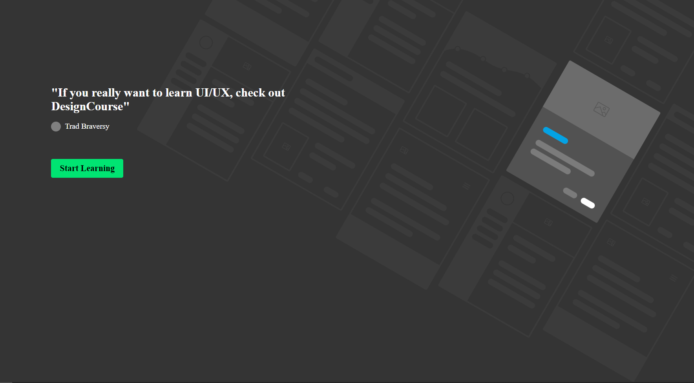

# GSAP-Tutorial

<h2>Training 1</h2>
<a href="https://gsap-training-1.netlify.app/" target="_blank">LIVE</a>

<h2>Training 2</h2>
<a href="https://gsap-training-2.netlify.app/" target="_blank">LIVE</a>

<h2>Training 3</h2>
<a href="https://gsap-training-3.netlify.app/" target="_blank">LIVE</a>

<h2>Training 4</h2>
Click Shop Button
<a href="https://gsap-training-4.netlify.app/" target="_blank">LIVE</a>

